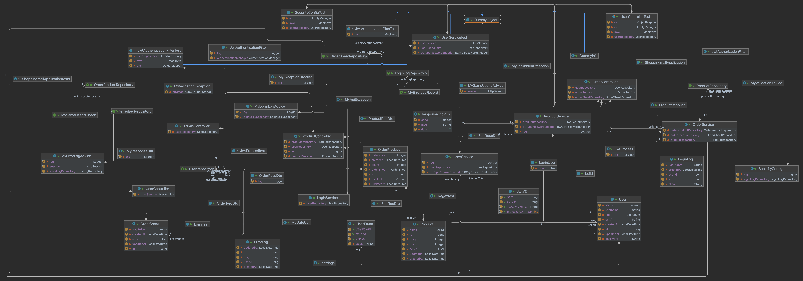

## 상품 주문 서비스 프로젝트

### 개요
1. 공통 모듈 / 공통 유틸리티
   - 사용자 권한 열거형 이용
   - Auditing 기능을 사용한 자동 타임스탬프 생성
   - 자주 사용하는 유틸을 모아둔 유틸 클래스
     - MyDateUtil : LocalDateTime타입을 DTO 반환을 위해 String으로 변환해주는 클래스
     - MyResponseUtil : 응답 DTO 클래스로 응답 DTO 작성시 사용하는 클래스로 성공을 응답하거나 실패를 응답한다.
   - AOP
     - MyErrorLogAdvice
         - @MyErrorLogRecord 커스텀 어노테이션 작성해, 로그인한 유저의 예외 발생시 자동으로 로깅처리
     - MyValidationAdvice
         - PostMapping과 PutMapping에 대해서 @Valid가 붙은 경우 유효성 검사 수행하고, Errors 객체에 결과를 담는다.
         - MyExceptionHandler의 예외처리 메서드에 모두 @MyErrorLogRecord를 붙여서 예외발생시 기록하도록 한다.
2. 토큰을 이용한 인증
   - 헤더에 JWT 토큰 노출
       ```java
       //(1) JS코드로 토큰에 접근해서 클라이언트의 로컬영역에 저장할 수 있도록 설정해야한다. (기본값이 disable)
       //(2) 실제 서버에서는 JWT 탈취 위험성 때문에 보안조치가 필요하다.
       //(3) 기본값은 cors-safelisted reponse header만 노출
       configuration.addExposedHeader("Authorization");
       ```
2. ApplicationListener로 로그인 로깅 구현
   ```java
   @Bean
     public ApplicationListener<AuthenticationSuccessEvent> authenticationSuccessListener() {
        return (ApplicationListener<AuthenticationSuccessEvent>) event -> {
            Authentication authentication = event.getAuthentication();
            log.debug("디버그 : onAuthenticationSuccess 호출됨");
            // 1. 로그인 유저 정보 가져오기
            LoginUser userDetails = (LoginUser) authentication.getPrincipal();
            User loginUser = userDetails.getUser();
            HttpServletRequest request = ((ServletRequestAttributes) RequestContextHolder.currentRequestAttributes()).getRequest();

            // 2. 최종 로그인 날짜 기록 (더티체킹 - update 쿼리 발생)
            //        loginUser.(LocalDateTime.now());
            // 3. 로그 테이블 기록
            LoginLog loginLog = LoginLog.builder()
                    .userId(loginUser.getId())
                    .userAgent(request.getHeader("User-Agent"))
                    .clientIP(request.getRemoteAddr())
                    .build();
            loginLogRepository.save(loginLog);
        };
    }
   ```
3. 
4. LAZY 로딩과 단방향 매핑을 이용해 쿼리를 수행하도록 한다.
   - OrderSheet와 OrderProduct는 일대다 관계로, 단방향 매핑으로 연결
   - 비즈니스 로직에 따라 유기적으로 동작하도록 작성
   - @EntityGraph로 LAZY LOADING 발동 하도록 해서 N+1문제 해결

### 테스트
1. 테스트시 인증처리 용이하도록 설정
   ```java
    //(1) 테스트를 위한 코드 실행전에 로그인 필요
    //(2) 실제 로그인 로직 : jwt -> 인증 필터 -> 시큐리티 세션 생성
    //(3) JWT를 이용한 토큰 방식의 로그인보다는, 세션에 직접 LoginUser를 주입하는 방식으로 강제 로그인 진행
    //    @WithUserDetails(value = "ssar")    //DB에서 해당 유저를 조회해서 세션에 담아주는 어노테이션
    //    setUp()으로 추가 했음에도 setupBefore=TEST_METHOD 에러 발생
    //(4) TEST_METHOD 설정시 @WithUserDetails가 setUp() 메서드 수행 전에 실행시간이 같다.
    //(5) TEST_EXECUTION 설정으로 @WithUserDetails가 setUp() 메서드 수행 후에 실행하도록 한다.
    @WithUserDetails(value = "ssar", setupBefore = TestExecutionEvent.TEST_EXECUTION)    //DB에서 해당 유저를 조회해서 세션에 담아주는 어노테이션
    ```
2. 테스트를 위한 더미 오브젝트 작성 -더미 오브젝트는 단위테스트를 위해 id를 명시적으로 지정한다.
    ```java
    public class DummyObject {
        //모두 스태틱 메서드
        protected User newUser(String username){
            BCryptPasswordEncoder passwordEncoder= new BCryptPasswordEncoder();
            String encPassword = passwordEncoder.encode("1234");
            return User.builder()
                    .username(username)
    //                .password("1234")
                    .password(encPassword)
                    .email(username+"@nate.com")
                    .role(UserEnum.CUSTOMER)
                    .build();
        }
        protected static User newMockUser(Long id,String username){
            BCryptPasswordEncoder passwordEncoder= new BCryptPasswordEncoder();
            String encPassword = passwordEncoder.encode("1234");
            return User.builder()
                    .id(id)
                    .username(username)
    //                .password("1234")
                    .password(encPassword)
                    .email(username+"@nate.com")
                    .role(UserEnum.CUSTOMER)
                    .build();
        }
    ```

3. 모키토 통합 테스트시 사용하는 어노테이션
    ```java
    @ActiveProfiles("test")
    //(1) dev 모드에서 발동하는 DummyInit의 유저가 삽입되므로, 테스트에서 test 프로퍼티파일 사용하도록 하는 설정
    //@Transactional
    @Sql("classpath:db/teardown.sql")
    //(2) 테스트코드에서는 @Transactional 어노테이션 사용하는 대신,
    // 외래키 제약조건 해제 후, 테이블 truncate 수행한다음 다시 외래키 제약조건 설정 
    @AutoConfigureMockMvc
    //(3) 모키토 환경에서 MockMvc 객체를 사용하기 위한 어노테이션
    @SpringBootTest(webEnvironment = WebEnvironment.MOCK)
    //(4) 웹 애플리케이션을 위한 Mock 객체를 빈으로 주입해주는 어노테이션
    ```
   

   